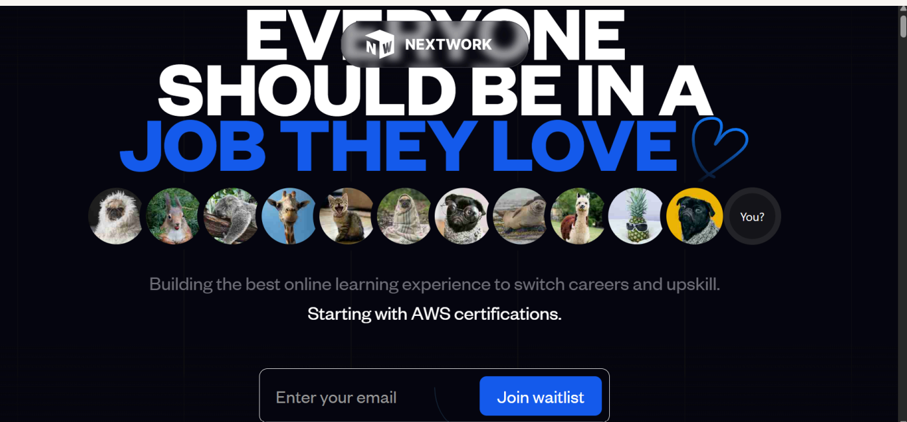
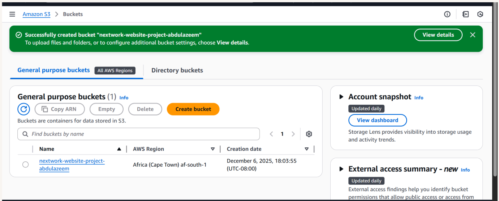
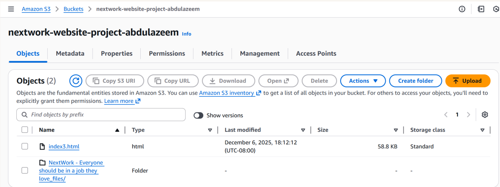
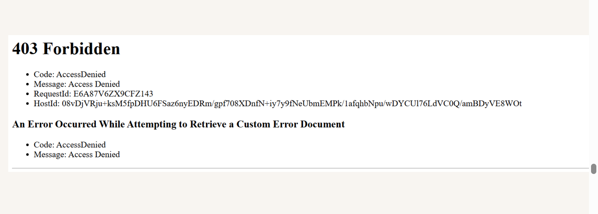

# 🚀 Host a Static Website on Amazon S3  
 Abdulazeem Badmus  

---

## 📑 Table of Contents
- [Project Overview](#project-overview)  
- [Tools and Concepts](#tools-and-concepts)  
- [How I Set Up an S3 Bucket](#how-i-set-up-an-s3-bucket)  
- [Upload Website Files to S3](#upload-website-files-to-s3)  
- [Static Website Hosting on S3](#static-website-hosting-on-s3)  
- [Bucket Endpoint & 403 Error](#bucket-endpoint--403-error)  
- [Success – Fixing the Error](#success--fixing-the-error)  
- [Conclusion](#conclusion)

---

## 📘 Project Overview

In this project, I demonstrated how to host a **static website** using **Amazon S3**.  
This hands-on project helped me understand the fundamentals of cloud deployment, S3 bucket configuration, static hosting, ACL permissions, and bucket policies.

This project took approximately **45 minutes** to complete.
 
  

---

## 🛠 Tools and Concepts

### **AWS Services Used**
- Amazon S3  
- IAM  
- S3 Static Website Hosting  

### **Key Concepts Learned**
- Object storage fundamentals  
- Bucket naming rules  
- ACLs (Access Control Lists)  
- Bucket policies  
- Static website hosting  
- Cloud deployment workflow  

---

## 🪣 How I Set Up an S3 Bucket

In this phase, I created the S3 bucket where the website files would be stored.  
I also enabled static website hosting so S3 could serve the site publicly.

### 🔑 Key Points
- Bucket creation took **less than 2 minutes**  
- Region selected: **af-south-1 (South Africa)** for lower latency  
- S3 bucket names must be **globally unique**  

  

---

## 📤 Upload Website Files to S3

Next, I uploaded all website content — including the HTML file and the folder containing images referenced by the site.

### 💡 Why this matters
- The HTML file depends on the images  
- Missing images = broken UI  
- S3 must store the **same folder structure** used by the site  

 
  

---

## 🌐 Static Website Hosting on S3

I enabled **Static Website Hosting** from the bucket properties to generate a public URL for the website.

### 🔧 What I configured
- Enabled static website hosting  
- Set the index document  
- Generated the hosting endpoint  

### 🔐 Understanding ACLs
ACLs determine who can view or modify objects.  
To make a website public, objects must have **public read access**.

  

---

## 🚫 Bucket Endpoint & 403 Error

The first time I visited the S3 endpoint, I encountered a **403 Forbidden** error.

### ❗ Why this happened
Even though the bucket was public, the **objects themselves** didn’t have public permission.

  

---

## ✅ Success – Fixing the Error

To resolve the error, I applied **public read access** via ACLs to each uploaded object.

Once fixed, the website loaded successfully.

  

---

## 🏁 Conclusion

Through this project, I learned how to:

- Create and configure an S3 bucket  
- Upload and manage static assets  
- Set up static website hosting  
- Understand ACLs and public access  
- Troubleshoot and fix 403 Forbidden errors  
- Deploy a fully functional static website using AWS  

This is a strong foundational cloud project demonstrating real-world AWS skills.  

---

